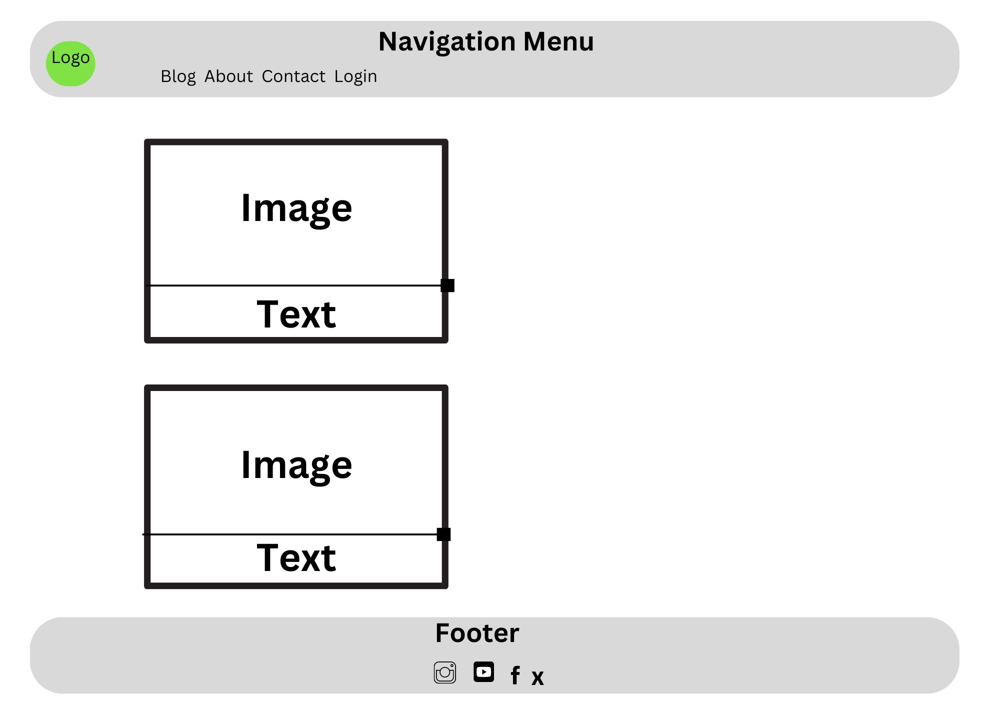
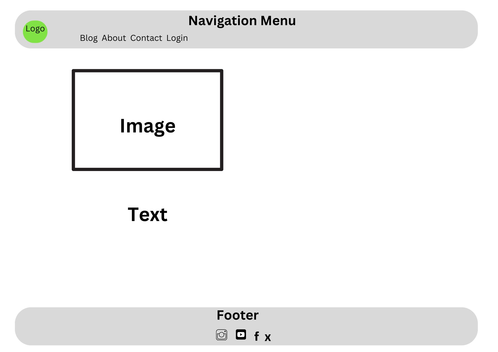
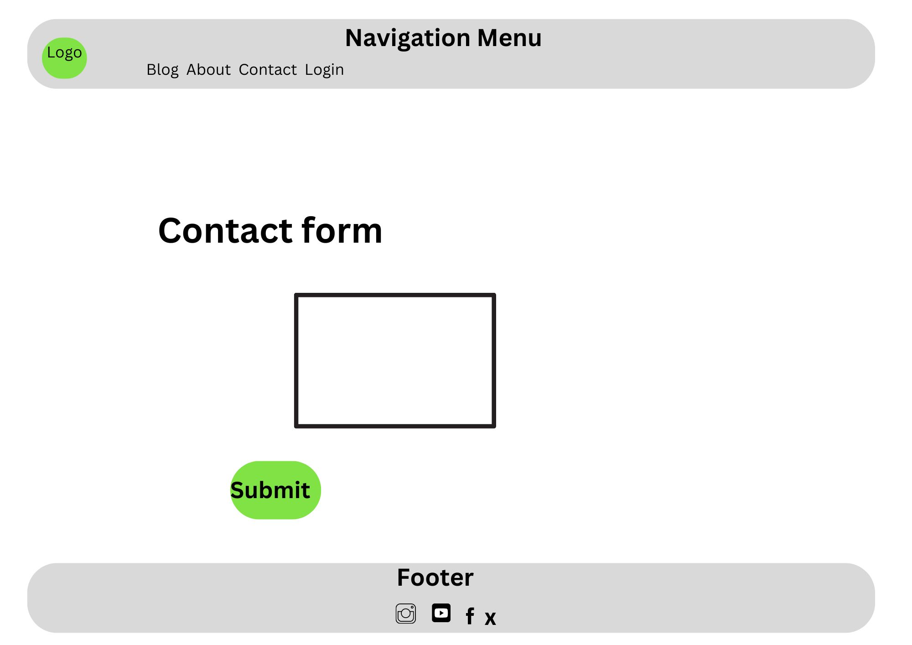
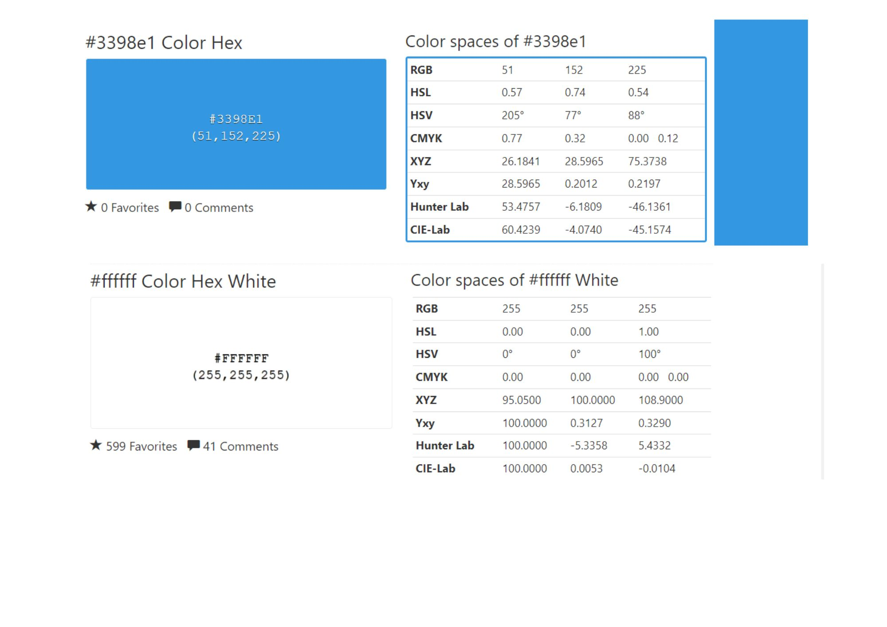
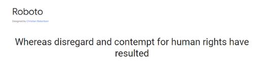
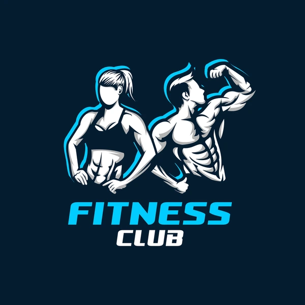
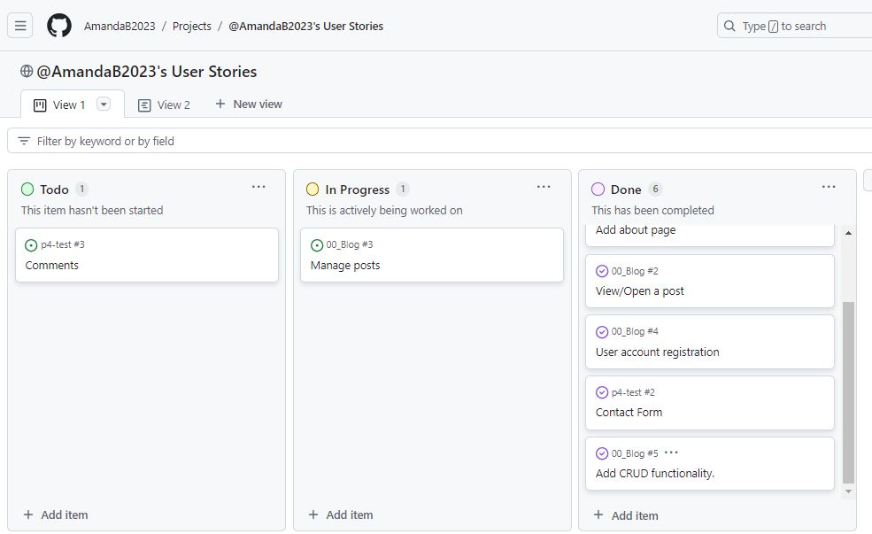
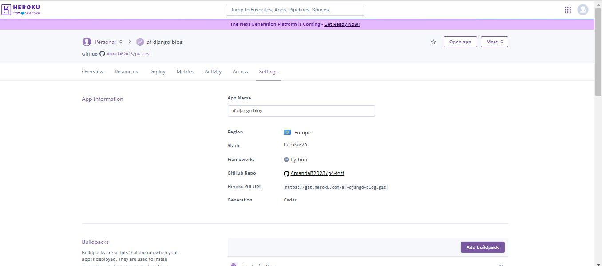
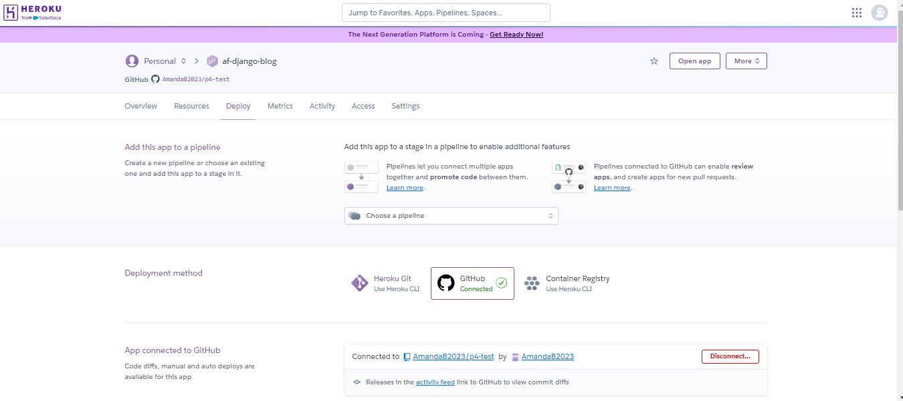
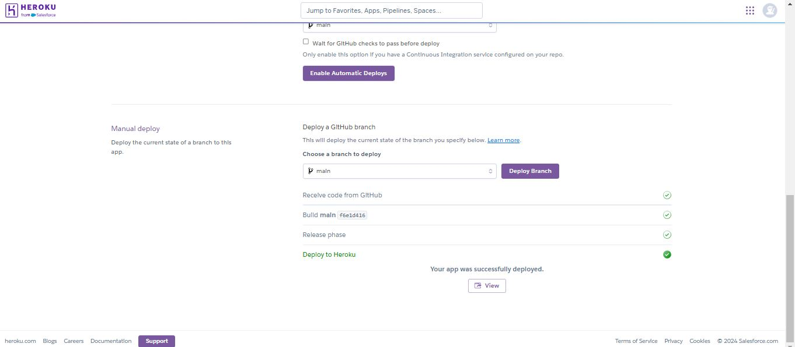

# Fitness Club Blog

Fitness Club is a fictional gym based in galway, they also has an online blog with posts coverong all the various differents aspects of health and fitness , as well as this they also do monthly product reviews and offer all the usual  and fitness  classes onsite.

## User Stories

### Basic User

* As a basic user I can view a list of blog posts.
* I can click on a blog post and view the full article.
* I can view comments left by registered users on each blog post.
* I can view the Fitness Clubs about page.
* I contact Fitness Club via the contact page.
* I can also register for the Fitness Club blog with my name and email.

### Registered User / Logged In Users

* As a resistered user I can log in to the blog 
* I can comment on the varioous diferent blog post.
* I can edit my comments.
* I can delete my comments.
* I can see that my comments are awaiting approval.
* I can book a free trial.
* I can logout of the blog.

### Site Administrator

* As a site administrator I can :
  * view, edit and delete blog post.
  * see a list of registered users.
  * see what users have commented on the blog posts.
  * approve users comments on the blog posts.
  * view messages form basic and regstered users that have contacted the blog.
  * delete contact messages.
  * edit the about page

### Features to Achieve Goals

* The blog will be responsive ona variety of devices,  I will also test it on various devices and screen sizes.

* A listt of blog posts will be displayed on the home/ blog page.

* A user can then click on a blog post to read the full article.

* The About page eill contain information about the blog itself.

* Logged in used will be able to leave comment with full CRUD functionality.

* Users will also be able to contact the blog via a contact page.

* Logged in users will also be able to book a free trial via the booking page.

## Site Structure
All pages will have:

* A responsive navigation bar. Which when viewed on larger screen sizes such as a laptop or desktop, will be at the top left side of the header. This allows the user to navigate through the site via page links to the blog, about, and contact pages.

* On the left side of the header opposite the navigation elements, we have a logo for Fitness Club which also acts as a link to the home page.

* On smaller screen sizes such as mobile phones or tablets to allow for a good user experience of the site, the Fitness Club navigation menu text is hidden to prevent the navigation bar from being cluttered. 

* When viewing the site with mobile devices and/or tablets the navigation links change to a toggle menu with the use of a burger icon. This was implemented to give the site a clean and non-cluttered appearance, as well as to provide a good user experience. Given that most users would already be familiar with seeing and using the burger icon when navigating websites on mobile and other smaller-screen devices.

* A footer that contains links and icons for the four main social media platforms namely Facebook, Instagram, Twitter and YouTube. 

## Wireframes

The wireframes for the website were designed using  [Canva](https://www.canva.com//) . The designs vary from the end layout in some places due to creative decisions made throughout the development process.

*   Home / Blog

*   About

*   Contact

## Design

The design of the blog was kept very basic to allow for the content of each blog post to be the feature.

### Color Scheme

For the colour scheme I took inspiration from my local gym whose colours are blue and white.

### Typography

Again I used basic Roboto as it is one of the most popular font types for use online . It conveys a clean and professional look and  is also easy for all users to read. I aslo set the bakup font to the in built Sans serif.

### Imagery

For my logo I used an image which I founf on a google search and it just suited the theme of my blog so It did not require any editing.

While the other images I used for the blog posts where free images I found online from various resources such as [Freepik](https://www.freepik.com/)

## Testing

Please refer to the [TESTING](TESTING.md) file for all test-related documentation.

## Agile Methodology

### GitHub Project Management

Was used in order to manage the development of the blog for my project , this was my first time using Github project Managment and I while I am still getting used to using this tool I found it very benefical to see what tasks I had completed and what was still outstanding.

## Technologies Used

The following technologies were used to complete this project.

### Languages:
*   [Python](https://www.python.org/downloads/release/python-385/): the primary language used to develop the blog
*   [HTML](https://developer.mozilla.org/en-US/docs/Web/HTML):the markup language used to create the blog.
*   [CSS](https://developer.mozilla.org/en-US/docs/Web/css):the styling language used to style the blog.

### Frameworks
*   [Django](https://www.djangoproject.com/): python framework used to create all the logic.
*   [GitHub](https://github.com/) was used to host the project code after being pushed.
*   [Heroku](https://dashboard.heroku.com/apps) - was used to deploy the project.

### Databases:
*   [SQLite](https://www.sqlite.org/): this database was used during development .
*   [PostgreSQL](https://www.postgresql.org/): is the database used to store all blog data.

### Other
*   [Gunicorn](https://gunicorn.org/): is the web server used to run the blog.
*   [Psycopg2](https://www.psycopg.org/): is the database driver.
*   [Django-allauth](https://django-allauth.readthedocs.io/en/latest/): the authentication library used to create user accounts.
*   [Django-crispy-forms](https://django-cryptography.readthedocs.io/en/latest/): was used to control the rendering behavior of Django forms.
*   W3C CSS Validation [W3C CSS Validation](https://jigsaw.w3.org/css-validator/)
*   W3C Markup Validation [W3C Markup Validation](https://validator.w3.org/)
*   JSHint to validate my javascript code [JSHint](https://jshint.com/)

## Deployment

### Deployment using Heroku

To deploy the repository:
1.   Log into or sign up for a Heroku account.
2.   Navigate to the dashboard.
3.   Navigate to "New" in the top right, select "Create New App" from dropdown menu
4.   Enter a unique name for the app. 
5.   Select your region.

6.   Click  "Create App".
7.   Navigate to "Deploy"  scroll down to "Deploy Method" and connect the repository with GitHub.
8.   Navigate to "Settings".
9.   In the section "Config Var", click on the button "Reveal Config Vars".
10. Click on "Add a new Config Var" and add the necessary keys and values.
    - SECRET_KEY with the value of the secret key.
    - DATABASE_URL with the value of the database URL.
    - CLOUDINARY_URL with the value of the cloudinary URL.
11. Navigate to section "Deploy" on the top navigation menu.
12. Select "GitHub" as the deployment method.

13. Search for the repository to be deployed by using the search bar and click "Connect".
14. Select the repository branch to be deployed.
15. Choose "Manual" deployment.
    - Manual deployment must be manually re-deployed after pushing new changes to the repository.
    - Crucial when working with DEBUG=True during development.

16.  Click the button "View" to open the link to the deployed project

#### Local Deployment
In order to make a local copy of this project, you can clone it. In your IDE Terminal, type the following command to clone my repository.

1.   Sign in to GitHub, locate the repository and click to open the repository.

2.   On the repository main page, click the green code button where the files are located. 

3.   This will open a drop down menu.

4.   In the dropdown menu stay on the HTTPS option and click the copy icon button next to the URL to copy it.

5.   Next open Git Bash and type git clone and your directory link.#

6.  Then type cd and the directory name.

7. Then code . to open VS Studio using Windows.

## Future Improvments

*   Make improvements to the contact form to make it more aestertically pleasing.
*   Add a search box to allow uses to seach for certain blog posts which intrest them.
*   Improve my use of Github Project Management as I found it difficent to get used to using although it was quite benefical.
*   When a user bookins a free trial sent an email conforming this.

## Credits

*   Fonts were imported from Google Fonts.
*   Icons were imported from Font Awesome.
*   The Code Institute I think Therefore I blog walkthrough p for the basic blog structure 
* [Django](https://www.djangoproject.com/) for the framework.

### Content
* The content for the blog posts I took from [Spunout](https://spunout.ie/) and [Womens Best](https://ie.womensbest.com/)

### Tools
*   [Canva](https://www.canva.com) was used to create the logo and to resize the images where needed.
*   Snipping Tool was used to take pictures of my screen for testing.
*   [Freeconvert](https://www.freeconvert.com/) was used to convert my images from jpg or png to webp.
* [Font awesome](https://fontawesome.com/): for the free access to icons.
*  [Responsive Viewer](https://chrome.google.com/webstore/detail/responsive-viewer/inmopeiepgfljkpkidclfgbgbmfcennb/related?hl=en): for providing a free platform to test website responsiveness

## Acknowledgments 
*   First and foremost my mentor Juliia Konovalova for all her advice and guidance on this first project. She was a great help throughout.

*   Code Institute tutors and Slack community members for their support and help.