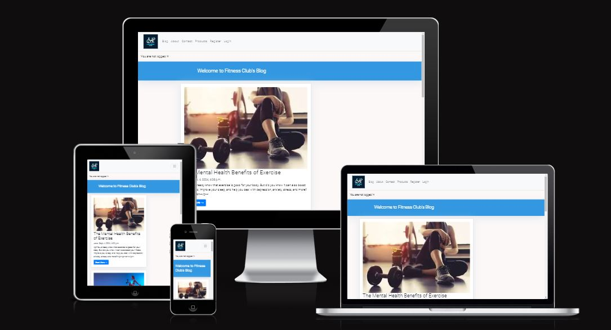

# Testing

This project was  tested throughout the development stage. 

## Validator

## Manual Testing

| Section Tested | Input To Validate | Expected Outcome |  Pass/Fail |
| -------------- | ----------------- | ---------------- |  --------- |
| Navbar | | | | | |
| Home | Click on the "Blog" link | The user is redirected to the main page | Yes | Yes | - |
| About | Click on the "About" link | The user is redirected to the for about | Yes | Yes | - |
| Contact | Click on the "Contact" link | The user is redirected to the contact page | Yes | Yes | - |
| Contact page | | | | | |
| Name input | Enter  name | name is entered | Yes | Yes | If user doesn't enter the  name, the error message appears |
| Email input | Enter the email | The email is entered | Yes | Yes | If user doesn't enter the email, the error message appears. If user enters not valid email, the error message appears |
|Message input | Enter the enquiry message | The enquiry is entered | Yes | Yes | If user doesn't enter the enquiry, error message appears
| "Submit" button | Click on the "Submit" button | The user is redirected to the response page Thank You | Yes | Yes | - |
| Thank You page | | | | | |
| Response message | The user will be automatically redirected to the home page after 10 seconds | The user is redirected to the home page | Yes | Yes | - |
| Footer | | | | | |
| Instagram icon in the footer | Click on the Instagram icon | The user is redirected to the Instagram page | Yes | Yes | - |
| Facebook icon in the footer | Click on the Facebook icon | The user is redirected to the Facebook page | Yes | Yes | - |
| Twitter icon in the footer | Click on the Twitter icon | The user is redirected to the Twitter page | Yes | Yes | - |
| YouTube icon in the footer | Click on the YouTube icon | The user is redirected to the YouTube page | Yes | Yes | - |
| Blog page | | | | | |
| Read More  |When user clicks on this the can view the full log post | | Yes|Yes | |
|User Login | Submit registration form   | The user can then view anf leave a comment | Yes | Yes | - |

## Lighthouse Report