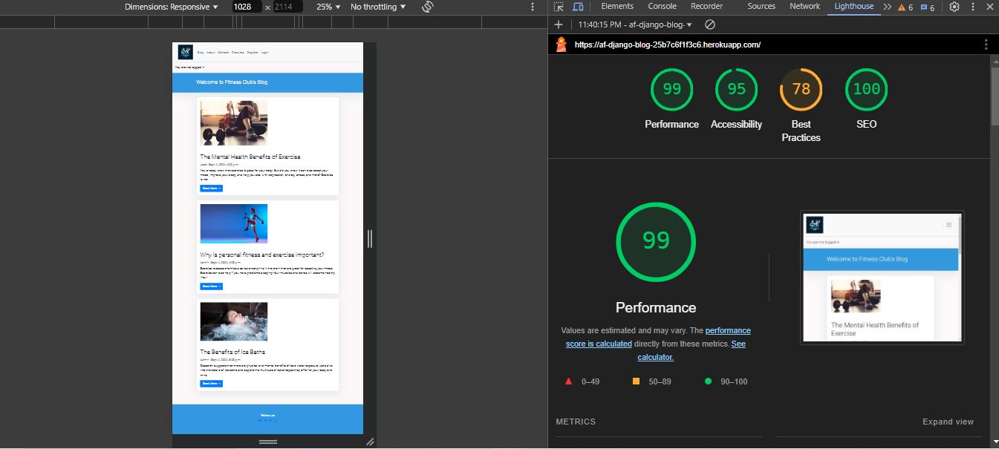
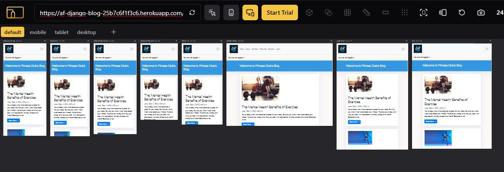
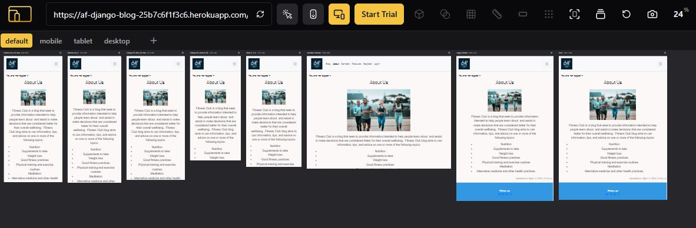
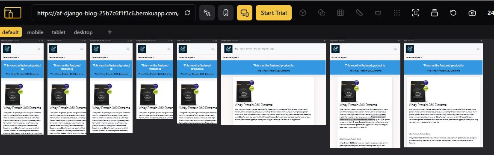
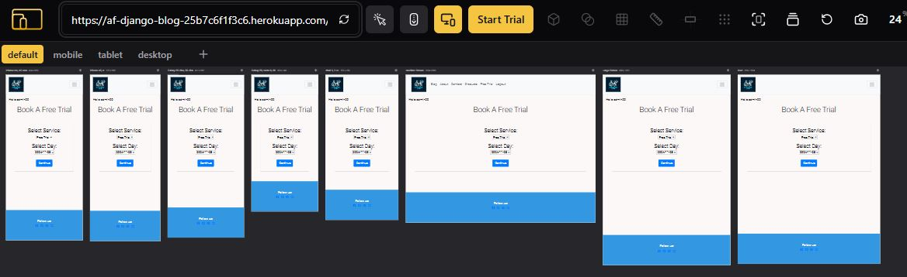

# Testing

This project was  tested throughout the development stage. 

## Lighthouse Report

I undertook lighthouse testing an fell down slightly on best practices, this was mainly due to using cloudinary and the lack of HTTPS.

## Responsiveness

The website was checked manually using Devtools on both Microsoft Edge and Google Chrome.

The website was also checked using the responsive viewer extention on google chrome which shows the website on various different screen sizes.

*   Blog

*   About

*   Products

*   Booking

## Manual Testing

| Section Tested | Input To Validate | Expected Outcome |  Pass/Fail |
| -------------- | ----------------- | ---------------- |  --------- |
| Navbar | | | | | |
| Home | Click on the "Blog" link | The user is redirected to the main page | Yes | Yes | - |
| About | Click on the "About" link | The user is redirected to the for about | Yes | Yes | - |
| Contact | Click on the "Contact" link | The user is redirected to the contact page | Yes | Yes | - |
| Products | Click on the "Products" link | The user is redirected to the products | Yes | Yes | - |
| Login | Click on the "Login" link | The user is redirected to the login page | Yes | Yes | - |
| Register | Click on the "Register" link | The user is redirected to the registration page | Yes | Yes | - |
| Contact page | | | | | |
| Name input | Enter  name | name is entered | Yes | Yes | If user doesn't enter the  name, the error message appears |
| Email input | Enter the email | The email is entered | Yes | Yes | If user doesn't enter the email, the error message appears. If user enters not valid email, the error message appears |
|Message input | Enter the enquiry message | The enquiry is entered | Yes | Yes | If user doesn't enter the enquiry, error message appears
| "Submit" button | Click on the "Submit" button | The user is redirected to the response page Thank You | Yes | Yes | - |
| Thank You page | | | | | |
| Response message | The user will be automatically redirected to the home page after 10 seconds | The user is redirected to the home page | Yes | Yes | - |
| Footer | | | | | |
| Instagram icon in the footer | Click on the Instagram icon | The user is redirected to the Instagram page | Yes | Yes | - |
| Facebook icon in the footer | Click on the Facebook icon | The user is redirected to the Facebook page | Yes | Yes | - |
| Twitter icon in the footer | Click on the Twitter icon | The user is redirected to the Twitter page | Yes | Yes | - |
| YouTube icon in the footer | Click on the YouTube icon | The user is redirected to the YouTube page | Yes | Yes | - |
| Blog page | | | | | |
| |Read More  |When user clicks on this the can view the full log post | | Yes|Yes | |
||Logged in user  |  The user can then view and leave a comment | Yes | Yes | - |
| | |  Can also edit and delete comments they have made | Yes | Yes | - |
| Products page | | | | | |
|  |When user clicks on this they can see a detailed post of the product of the month  | | Yes|Yes | |
| Booking page | | | | | |
|A Logged in User | Can book a free trial  | They can select date and time and recive notification booking is accepyed | Yes | Yes | - |

## Validation Testing

### HTML

All HTML was validated using  [HTML W3C Validator](https://validator.w3.org) and passed valiation except for the blog post detail which I choose not to fix as the errors arose from using the django summernote plugin and to alter such would have lead to a decreaded user experience.

| File Name             | Pass | View Result                                                              | Notes                                                                                                                                                                                            |
| --------------------- | ---- | ------------------------------------------------------------------------ | ------------------------------------------------------------------------------------------------------------------------------------------------------------------------------------------------ |
| Blog       |   |   |  
| base.html         | ✅    | [Result](documentation/p4_base_html.jpg)      |  
| post_detail.html         |  ❌   | [Result](documentation/blog_post_detail_w3.jpg)      |  
| About      |   |   |  
| about.html         | ✅    | [Result](documentation)      |  
| Contact     |   |   |  
| contact.html         | ✅    | [Result](documentation/contact_w3.jpg)      |  
| contact_success.html         | ✅    | [Result](documentation/contact_sucess_w3.jpg)      |  
| Products      |   |   |  
| products.html         | ✅    | [Result](documentation/products_w3.jpg)      |  
| Free Trial      |   |   |  
| booking.html         | ✅    | [Result](documentation/booking_w3.jpg)      | 

### CSS

All Css was validated using [W3C Jigsaw](https://jigsaw.w3.org/css-validator/)

| File Name             | Pass | View Result                                                              | Notes                                                                                                                                                                                            |
| --------------------- | ---- | ------------------------------------------------------------------------ | ------------------------------------------------------------------------------------------------------------------------------------------------------------------------------------------------ |
| Home       |   |   |  
| base.css          | ✅    | [Result](documentation/p4_css.jpg)      |  
  
### Javascript

The javascrip for this project was validated using [Jshint](https://jshint.com/)

| File Name             | Pass | View Result                                                              | Notes                                                                                                                                                                                            |
| --------------------- | ---- | ------------------------------------------------------------------------ | ------------------------------------------------------------------------------------------------------------------------------------------------------------------------------------------------ |
| base.css          | ✅    | [Result](documentation/p4_comments.jpg)      |  

### Python 

The Python files for this project were validated using  [PEP8 CI Online](https://pep8ci.herokuapp.com/) in which there was a few issues with the lines of code being too long but i choose to leave these as they were not errors in the code as such and in most situations the overrun was minimal.

| File Name             | Pass | View Result                                                              | Notes                                                                                                                                                                                            |
| --------------------- | ---- | ------------------------------------------------------------------------ | ------------------------------------------------------------------------------------------------------------------------------------------------------------------------------------------------ |
| Blog     |   |   |  
| admin.py          | ✅    | [Result](documentation/p4_blog_admin.jpg)      |  
| models.py          | ✅    | [Result](documentation/p4_blog_models.jpg)      |  
| urls.py          | ✅    | [Result](documentation/p4_blog_urls.jpg)      |  
| views.py          | ✅    | [Result](documentation/p4_blog_views.jpg)      |  
| About       |   |   |  
| admin.py          | ✅    | [Result](documentation/p4_about_admin.jpg)      |  
| models.py          | ✅    | [Result](documentation/p4_about_models.jpg)      |  
| urls.py          | ✅    | [Result](documentation/p4_about_urls.jpg)      |  
| views.py          | ✅    | [Result](documentation/p4_about_views.jpg)      |  
| Contact      |   |   |  
| forms.py          | ✅    | [Result](documentation/p4_contact_forms.jpg)      |  
| models.py          | ✅    | [Result](documentation/p4_contact_models.jpg)      |  
| urls.py          | ✅    | [Result](documentation/p4_contact_urls.jpg)      |  
| views.py          | ✅    | [Result](documentation/p4_contact_views.jpg)      |  
| Booking     |   |   |  
| admin.py          | ✅    | [Result](documentation/p4_boooking_admin.jpg)      |  
| models.py          | ✅    | [Result](documentation/p4_booking_models.jpg)      |  
| urls.py          | ✅    | [Result](documentation/p4_booking_urls.jpg)      |  
| views.py          | ✅    | [Result](documentation/p4_booking_views.jpg)      |  
| Products    |   |   |  
| admin.py          | ✅    | [Result](documentation/p4_products_admin.jpg)      |  
| models.py          | ✅    | [Result](documentation/p4_products_models.jpg)      |  
| urls.py          | ✅    | [Result](documentation/p4_products_urls.jpg)      |  
| views.py          | ✅    | [Result](documentation/p4_products_views.jpg)      |  
| My Project     |   |   |  
| settings.py          | ✅    | [Result](documentation/p4_myproject_settings.jpg)      |  
| urls.py          | ✅    | [Result](documentation/p4_myproject_urls.jpg)      | 

